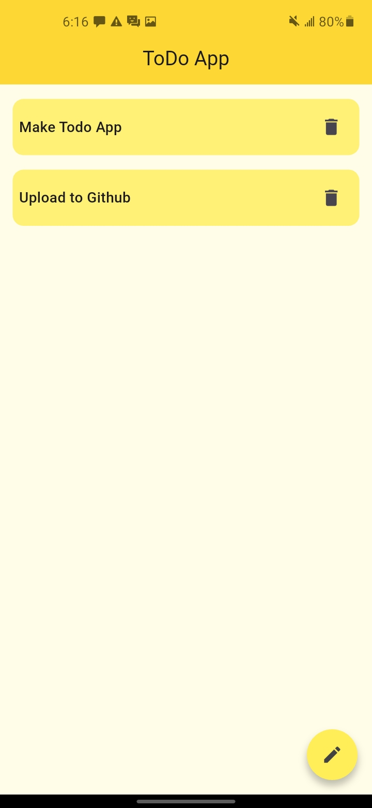

# Basic ToDo App Practice

# Flutter To-Do-App
A simple Flutter-based- To-Do application that allows users to:
- Add new tasks
- Mark tasks as completed
- Delete tasks

# Features 
Task Completion tracking

## Getting Started

1. Clone the repository
2. Run `flutter pub get` to install dependencies
3. Run `flutter run` to start the app

## Requirements 
- Flutter SDK
- Android Studio or Vs code with relevant extensions

## Project Structure
- `lib/main.dart`: Project entry point
- `pubspec.yaml`: Project dependencies
- `README.md`: Project documentation

## Screenshots of the UI
- 
- 
- 
- 
- 

